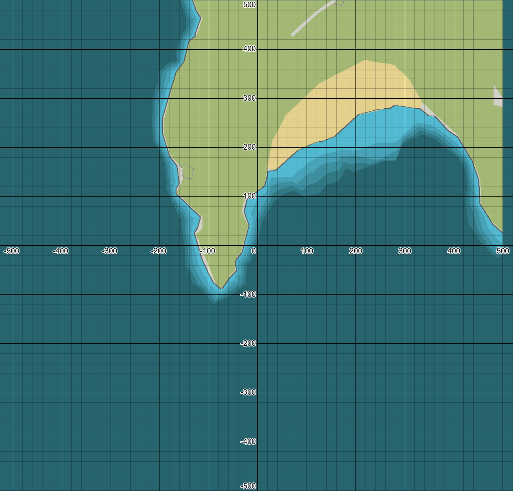
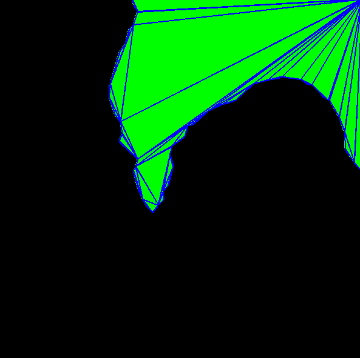
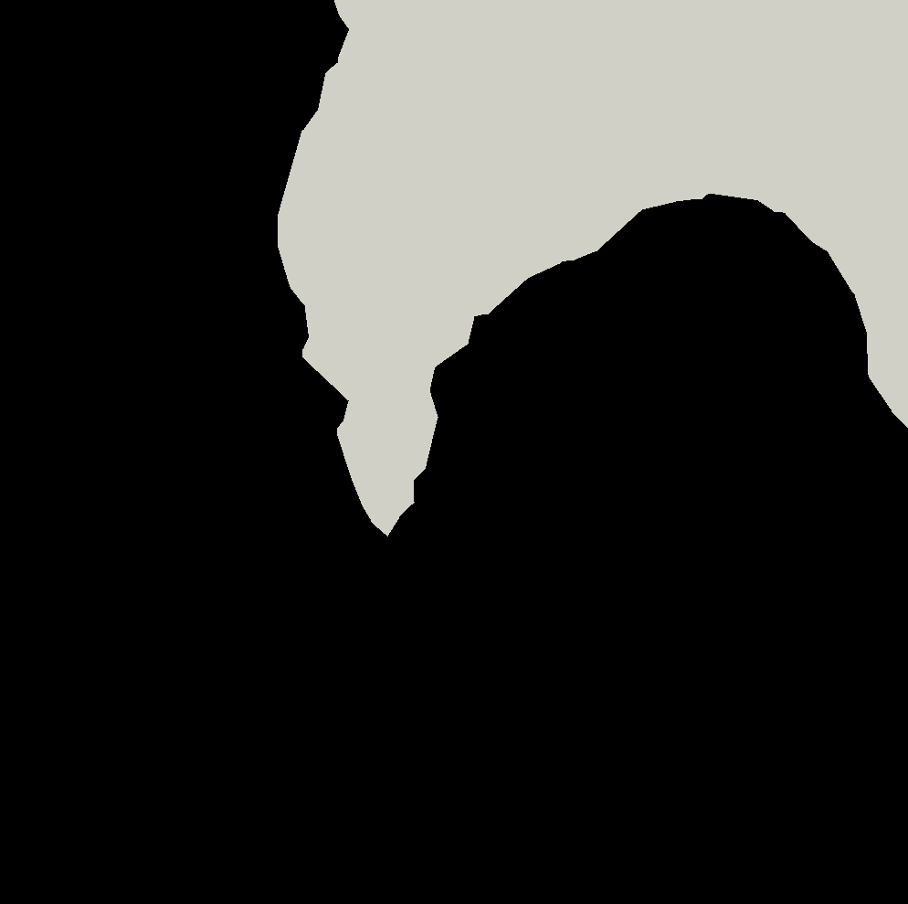
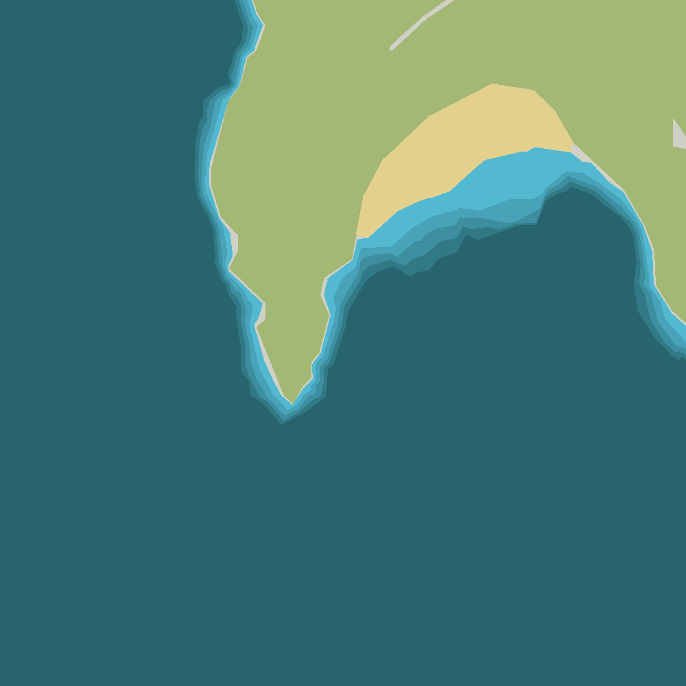
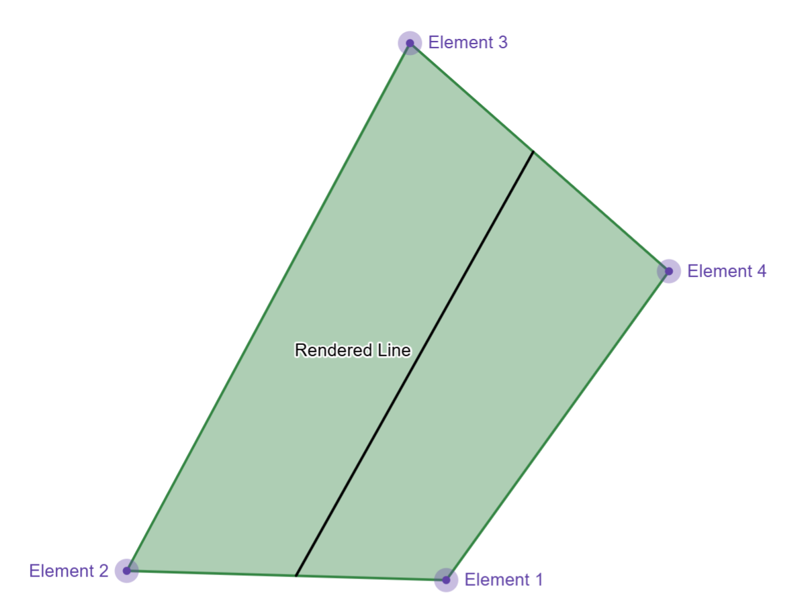
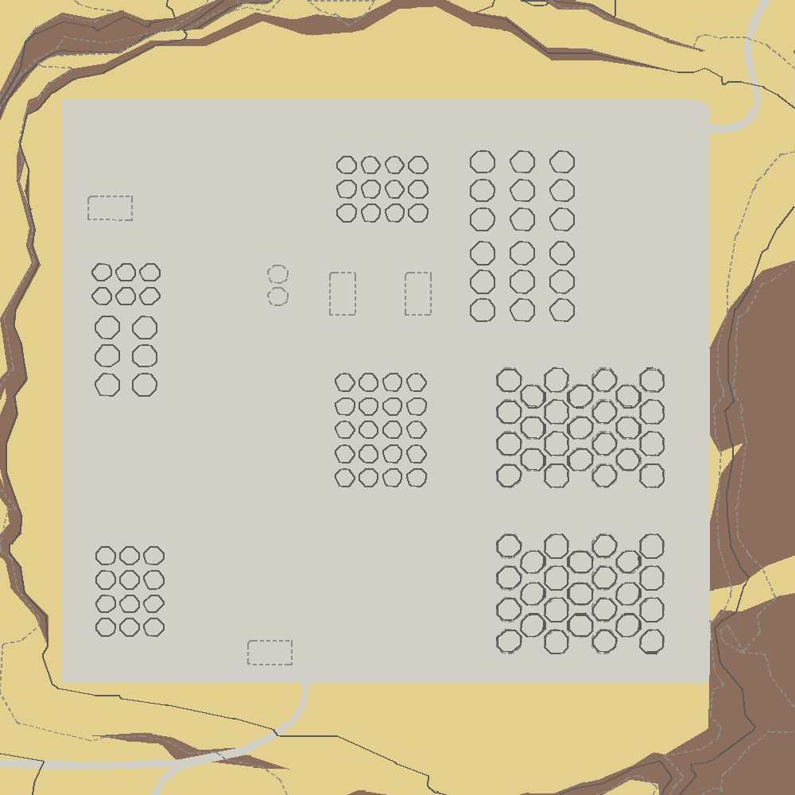

# Format Documentation

Here, I will lay out how the geometry bin files work. As with most things Stormworks related, the implementation is janky as hell, but it does some pretty cool things along the way. Let's start with the basics. As you probably know, each .bin file covers a square 1km^2 area. For the large main islands, this means that they consist of multiple tiles assembled together. For the main island it consists of a 20 x 10 tile area. The tiles indexing starts from the bottom left of the island, and changes with increasing x and y. So the tile `16_4` would be 1km to the right of, and 1km up from the tile: `15_3`. 

All geometry within the tile is represented with respect to the local coordinates of the tile, being centered at the center of the tile. Given that the tile is `1000m x 1000m`, all values for coordinates, lines, etc are in the range `[-500, 500]`, as seen in the diagram below. 

<div style="text-align: center;">

</div>

## Mesh Chunks

Now we can get into the file itself. The file starts with `11` consecutive "Mesh Chunks". The order that the chunks appear in the file is not the order they need to be rendered in. *because that would make too much sense*. The order in which the mesh chunks appear in the file is this:

<div align="center">

| Index| Earth| Moon|
| -----| ------------------| -----------------|
| 0| Road | Blank-1|
| 1| Grass| Blank-2|
| 2| Sand | Blank-3|
| 3| Pond | Blank-4|
| 4| Snow | Blank-5|
| 5| Rock | Blank-6|
| 6| HardRock| Blank-7|
| 7| Sea-3| Moon-3|
| 8| Sea-2| Moon-2|
| 9| Sea-1| Moon-1|
| 10| Sea-0| Moon-0|

</div>

However in order to make things look right, they actually need to be rendered in this order: 

<div align="center">

| Index| Earth| Moon|
| -----| ------------------| -----------------|
| 0| Sea-0| Moon-0|
| 1| Sea-1| Moon-1|
| 2| Sea-2| Moon-2|
| 3| Sea-3| Moon-3|
| 4| Road | Blank-1|
| 5| Grass| Blank-2|
| 6| Sand | Blank-3|
| 7| Pond | Blank-4|
| 8| Snow | Blank-5|
| 9| Rock | Blank-6|
| 10| HardRock| Blank-7|
</div>

The way that the actual mesh chunks work is really cool, but they make some really weird design choices along the way. Each mesh chunk is split into two parts. The first part is the vertex data, then we get to the triangle data. Each part is prefixed with a length, but what the length actually indicates isn't consistent, and has a separate definition for each part. 

<div align="center">

| Index| Name| Description|
| -----| ------------------| -----------------|
| 0| `Vertex Length Prefix`| The number of XYZ values in the following block. So if the following block just contains one coordinate, this value will be 1|
| 1| `Vertex Data`| An array of XYZ values. The total number of floats in this array = 3 * `Vertex Length Prefix`|
| 2| `Triangle Length Prefix`| The number of u16 values in the following array|
| 3| `Triangle Data`| An array of u16 values. The total number of u16 values in the array = `Triangle Length Prefix`|
</div>

The XYZ values are structured like so:

<div align="center">

| Index| Name| Description|
| -----| ------------------| -----------------|
| 0|X (float)| X location|
| 1|Y (float)| Y location *(always zero)*
| 2|Z (float)| Z location|
</div>

The number of elements in the `Triangle Data` is always a factor of 3, as each group of 3 indicates the 3 indices of the XYZ values for each triangle in the mesh. 

I can hear you asking quite a few questions here. First off, yes, they did change how they describe array length halfway through. For the vertex length, its the number of 3 float groups. In the triangle data, it's the total number of values? No idea why they did that. But to be clear:

If you are saving a mesh with these vertices:

```python
(3.0, 0.0, 3.0),
(3.0, 0.0, 0.0),
(0.0, 0.0, 3.0),
(0.0, 0.0, 0.0),
```

And the triangles
```python
(0, 1, 2),
(1, 2, 3)
```

The `Vertex Length Prefix` will be `4` and the `Triangle Length Prefix` will be `6`. Got it? 

Now we can move onto the other blunder they just made: **This is 2d data, why are they encoding full XYZ coordinates.** I have no idea why they did this. The Y coordinate is always zero in all the files. It is purely junk data. If you think that's bad, I wouldn't recommend reading further, because it gets way worse. 

Much like 3D rendering, the triangle vertex pairs have a certain winding order, so backface culling can be applied. For some reason, the mesh triangles on the map are rendered with backface culling, even though they always face forward. So, the face data for the mesh segments needs to be ordered so that it has a `Counter-Clockwise` winding order, otherwise it won't be rendered. 

<div style="text-align: center;">

</div>

Putting this all together, we can see what a single mesh layer looks like. I have shaded the triangles in green and also highlighted the edges of each triangle in the mesh, to really illustrate what we are looking at.  

<div style="text-align: center;">

</div>

Each of the 11 layers has a specific color that it is rendered with. These have default values, but as you know, most can be changed when drawing the map in Lua. The default layer values are as follows:


<div align="center">

| Layer Name | Earth Color (R, G, B) | Moon Color (R, G, B)    |
| ---------- | --------------------- | ----------------------- |
| Sea/Moon-0 | `(50, 121, 134)        `|` (134, 137, 151)         `|
| Sea/Moon-1 | `(61, 142, 159)        `|` (109, 112, 126)         `|
| Sea/Moon-2 | `(72, 163, 184)        `|` (84, 87, 101)           `|
| Sea/Moon-3 | `(83, 185, 209)        `|` (59, 62, 76)            `|
| Road       | `(208, 208, 198)       `|                         |
| Grass      | `(164, 184, 117)       `|                         |
| Sand       | `(227, 208, 141)       `|                         |
| Pond       | `(83, 185, 209)        `|                         |
| Snow       | `(255, 255, 255)       `|                         |
| Rock       | `(139, 110, 92)        `|                         |
| HardRock   | `(88, 62, 45)          `|                         |

</div>

They way things are actually rendered behind the scenes sheds some light on some interesting things. Take for instance the road at the top of the image. That isn't specifically put in the "Road" layer. Rather that geometry is actually in the "Grass" layer. This makes more sense if you look at the road and grass meshes separately: 

<div align="center">
  
  
</div>
See how the road layer doesn't have the road, but rather just canvases the entire open region of the island. Then there is just a gap in the grass layer, where the road can "shine through". this detail isn't really important, but could be if you are planning on using this library to gather map data. 

When each mesh is rendered with the proper color, and in the render order discussed previously, we get an image which looks a lot like:

<div style="text-align: center;">

</div>

Cool! Easy! Just some weird hiccups along the way. But there's one more thing, we need to render: ***lines***. 

## Quad Chunks

You may be confused. I just said we are going to talk about lines, why is the title of this area "Quad Chunks"? That's because, in their infinite wisdom, the devs decided to represent lines, as *quadrilaterals*. Why did they do this? Probably has to do with them rendering their lines using textures, rather than rendering them as actual lines. This makes sense if you look at a lot of the lines on the map, as some areas show weird geometry consistent with strange texture warping. There are `10` Quad Chunk groups, each representing a different group of lines. What each group represents is still unknown, as there is probably some meaning to each group, (like group 4 being buildings or somethin idk). We do however know how they are structured. And... it's bad. Like the Mesh Chunk, each Quad Chunk is length prefixed, however this time the length indicates the number of **Coordinate Groups** that are in the following chunk. 4 **Coordinate Groups** define a single quadrilateral. 

What do I mean by coordinate group? This is how they are represented:

<div align="center">

| Index| Name| Description|
| -----| ------------------| -----------------|
| 0|X (float)| X location|
| 1|Y (float)| Y location *(always zero)*
| 2|Z (float)| Z location|
| 3|Altitude (4 bytes) | I don't actually know what this field is. It looks like an altitude? It could potentially be a color. However **it does nothing** leaving this field zero has no effect on gameplay as far as I can tell. Ducky does not do anything with this field, it ignores it on import, and leaves it 0 on export.|
| 4|One Or Zero (float)| This field is always either 1 or 0, in a specific pattern. For each element of the quadrilateral, this field follows this pattern: `1,0,0,1`|
</div>

Now dear reader, I again hear your cries. Yes they did encode this 2D element with 3D coordinates again. And yes, they also somehow managed to tack on 2 additional fields which do *absolutely nothing*. And yes, they are encoding a boolean variable as a float. 

I feel I have to point out again the incredible nonsense that this is before continuing. This entire line element could have been represented by 2 X,Y coordinates, totalling up to 16 bytes. Instead they opted to use a 3D quadrilateral, and in the process also tacked on 8 additional fields which do nothing. They end up with a gigantic datatype which totals up to a whopping 80 bytes, 5 times bigger than it needed to be.

***BUT WAIT THERES MORE***

The quads **also have a winding order**. The quadrilateral for the lines needs to be encoded `Clockwise`. You may notice that this is backwards to how the mesh chunks are. You would be correct, they pulled another switcheroo. 

The way that Stormworks renders these lines based on the quadrilateral appears to be like so:

<div style="text-align: center;">

</div>

This is again, most likely accomplished through texture based rendering, and the quadrilateral is used to stretch, and scale the texture to conform to the target line. Ducky approximates this by taking the midpoint between element 1 and 2, as well as the midpoint between element 3 and 4, and draws a line between both midpoints. 

Adding that back into our render from earlier, we get our final result: 

<div style="text-align: center;">

</div>

Yeah that picture didn't really have too many lines in it. But here's one that does:

<div style="text-align: center;">

</div>

And that is how the map data is encoded! There is however one last twist in this tale. At the end of the file *sometimes* there are 4 extra, useless \x00 bytes. I have put a flag into the code to detect if the game ever does anything with those bytes, but it has never flagged for me. Ducky omits them entirely. The only purpose I have found for these bytes, is just to torture those who decide to reverse engineer this packet format. 

Thanks for reading. 

Cheers!
