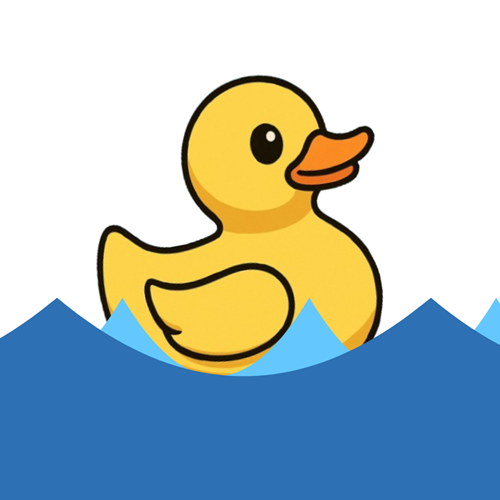
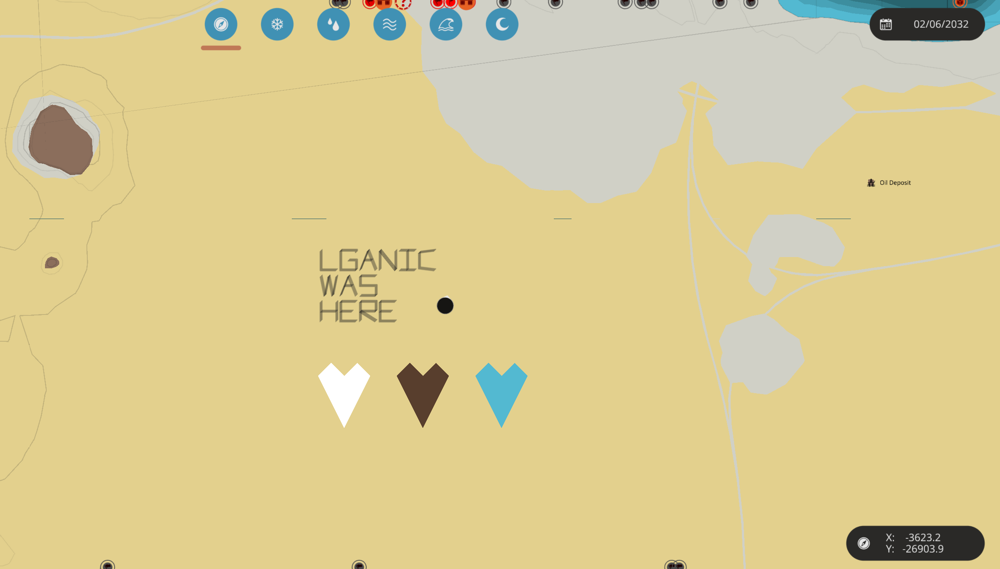
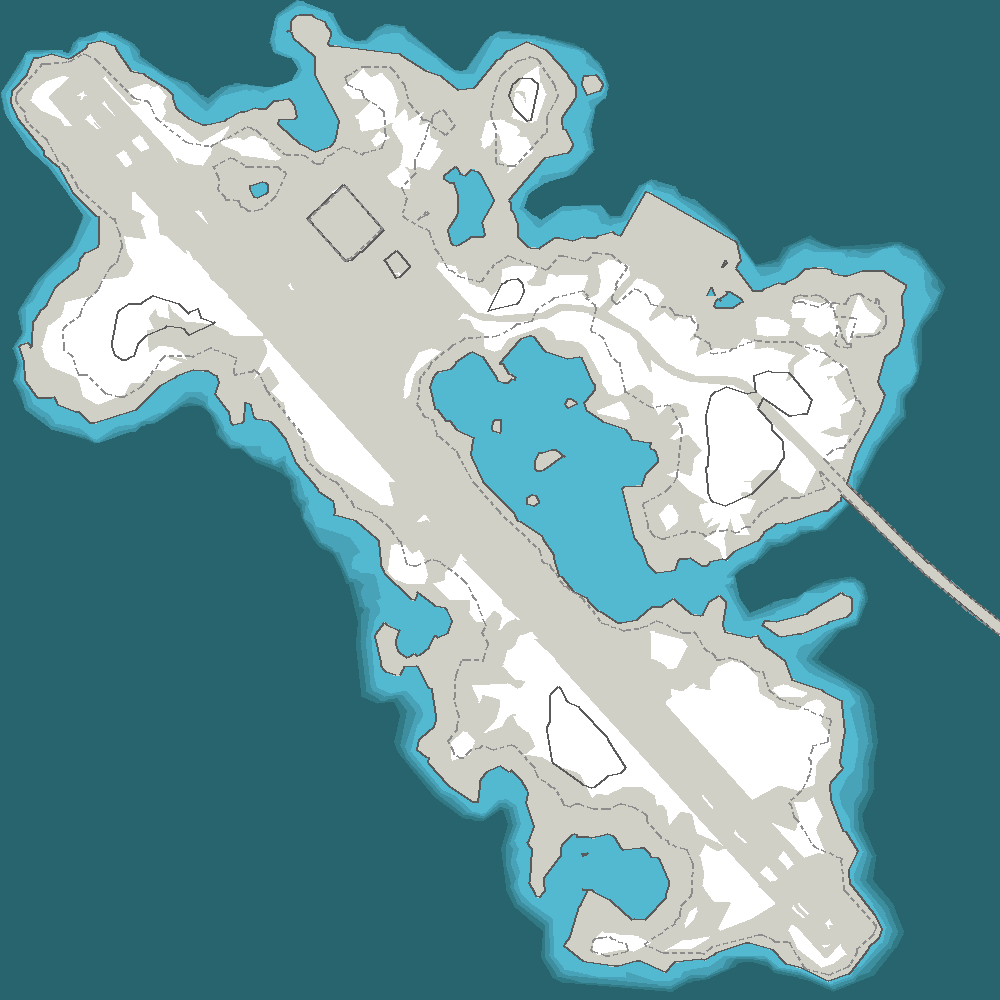
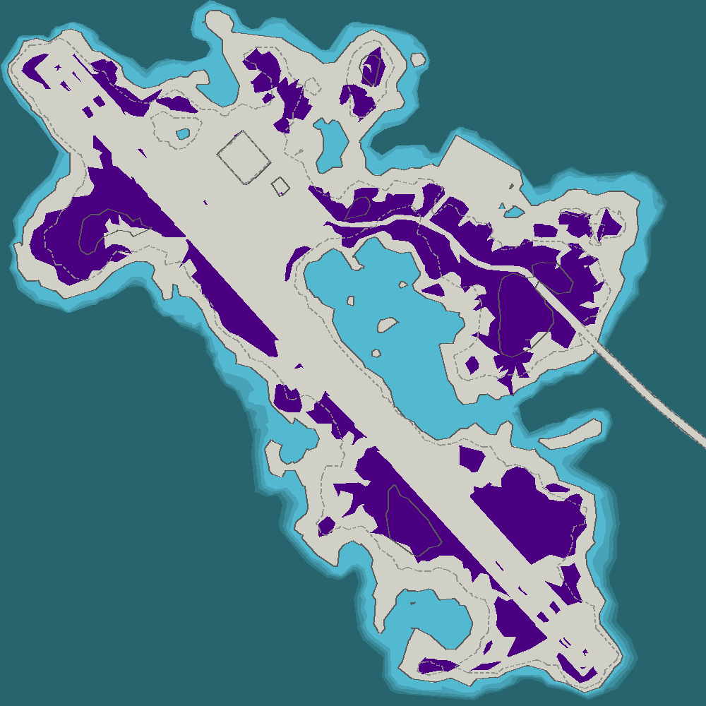
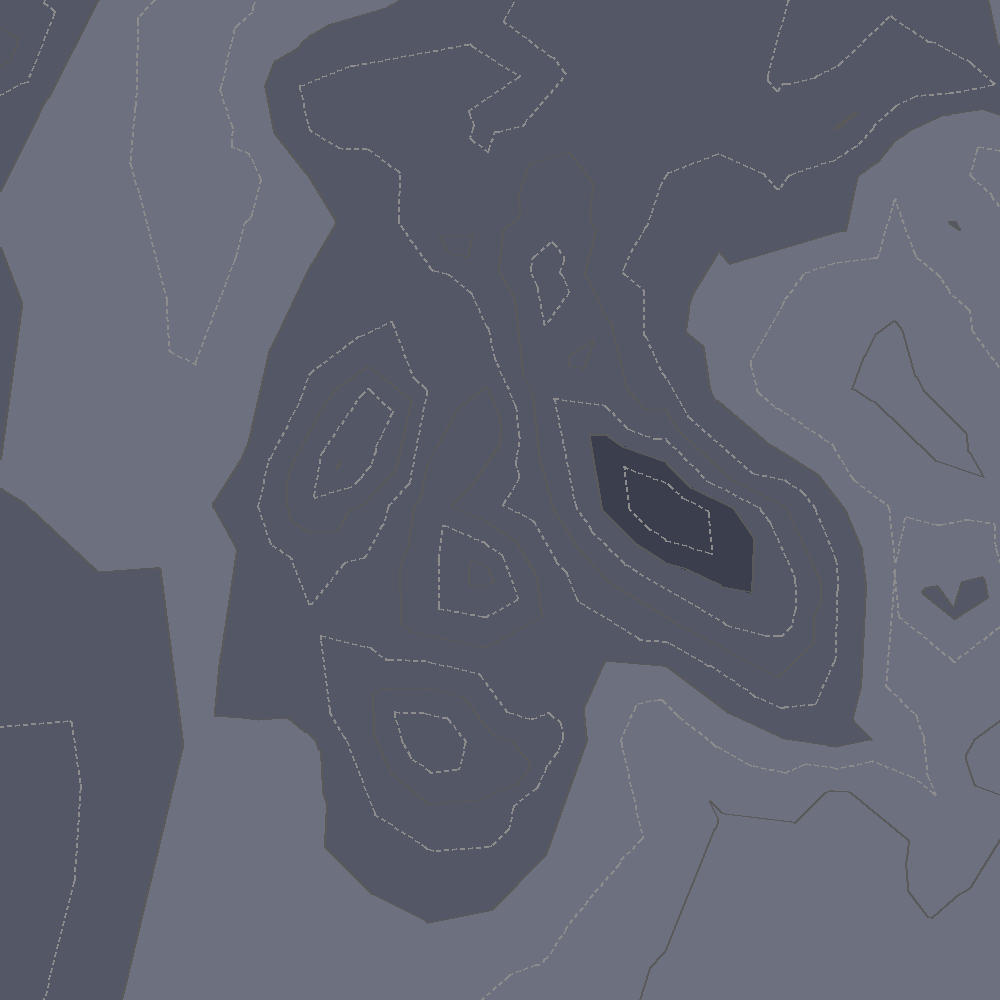

# SW-Ducky

### A python library for creating, loading, and exporting Stormworks Map `.bin` files.
---

<div style="text-align: center;">

</div>

---

Ducky currently accounts for most of the fields contained within `.bin` files, and contains basic built in utilities for creating, loading, editing, and exporting bin files. An example of an edited tile is seen below, where some text and new geometry was added. 

<div style="text-align: center;">

</div>

This example was made using the following code:

*Obviously in these examples, you will want to adjust the .bin file path to point to your actual file*

```python
from sw_ducky import MapGeometry

geo = MapGeometry.from_file('arid.bin')
geo.add_bolded_text(1,'lganic\nwas\nhere', -400, 300, 75, thickness=10)

geo.add_geometry('HardRock',[
                    # Vertex Data
                    (0, -300), (-100, -100), (-50, -50), (0, -100), (50, -50), (100, -100),
                    ],[
                    # Edge Data
                    (3, 1, 0), (3, 2, 1), (5, 4, 3), (5, 3, 0),
                    ])

geo.add_geometry('Snow',[
                    # Vertex Data
                    (-300, -300), (-400, -100), (-350, -50), (-300, -100), (-250, -50), (-200, -100),
                    ],[
                    # Edge Data
                    (3, 1, 0), (3, 2, 1), (5, 4, 3), (5, 3, 0),
                    ])

geo.add_geometry('Pond',[
                    # Vertex Data
                    (300, -300), (200, -100), (250, -50), (300, -100), (350, -50), (400, -100),
                    ],[
                    # Edge Data
                    (3, 1, 0), (3, 2, 1), (5, 4, 3), (5, 3, 0),
                    ])

geo.save_as(tile_path)
```

Ducky also has a built in function to render tiles, that uses python's `pillow` module. This can be used to render out tile images straight to pillow `Image` objects. Therefore a quick script to load, and preview a tile looks like:

```python
from sw_ducky import MapGeometry

image_size = 1000

geo = MapGeometry.from_file('arctic.bin')
img = geo.render_to_image(image_size)

img.show()
```

Resulting image: 

<div style="text-align: center;">

</div>

You can also change the colors of certain layers, and see what the resulting image looks like. 

```python
from sw_ducky import MapGeometry

image_size = 1000

geo = MapGeometry.from_file('arctic.bin')

geo.layer_colors['Snow'] = (75, 0, 130) # Purple snow

img = geo.render_to_image(image_size)

img.show()
```

<div style="text-align: center;">

</div>

Moon tiles are also supported, with a flag indicating the switch between moon rendering, and earth rendering. 

```python
from sw_ducky import MapGeometry

image_size = 1000

geo = MapGeometry.from_file('moon.bin', moon = True)

img = geo.render_to_image(image_size)

img.show()
```

<div style="text-align: center;">

</div>

Ducky currently accounts for all 11 mesh layers, and assigns them human readable names to make code easier to read. 
These are the names of each layer in Ducky, in the order they are rendered: 

<div align="center">

| Index | Earth  | Moon|
| ----- | ------------------ | ----------------- |
| 0     | Sea-0              | Moon-0            |
| 1     | Sea-1              | Moon-1            |
| 2     | Sea-2              | Moon-2            |
| 3     | Sea-3              | Moon-3            |
| 4     | Road               | Blank-1           |
| 5     | Grass              | Blank-2           |
| 6     | Sand               | Blank-3           |
| 7     | Pond               | Blank-4           |
| 8     | Snow               | Blank-5           |
| 9     | Rock               | Blank-6           |
| 10    | HardRock           | Blank-7           |
</div>
Wether or not that is what they are *actually* called in the code is kinda unknown. Would love to hear if someone knows. These are my best guesses. 

The actual rendering process currently has a few unknowns associated with it, mostly related to the ways that lines are represented. However the current rendering process accounts for most of the weirdness. 
<div align="center">
  
  
  
</div>

As you can see, Ducky does it best to abstract away much of the internal complexities of this file. Leaving a simple, straightforward interface for modifying or creating tiles. Collaboration is encouraged, for further developments. 